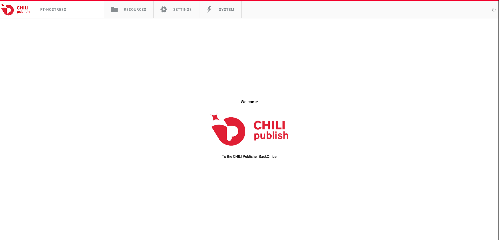
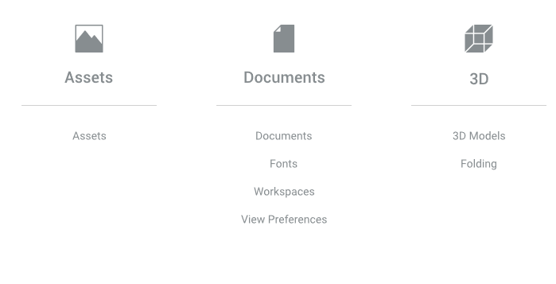
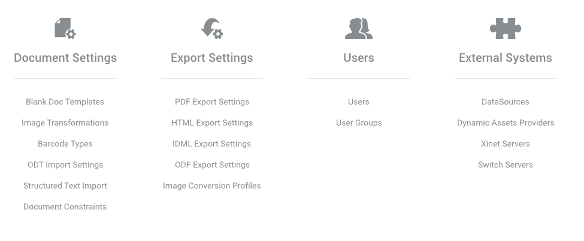
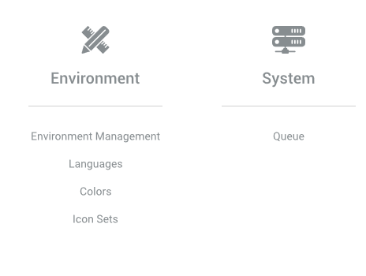
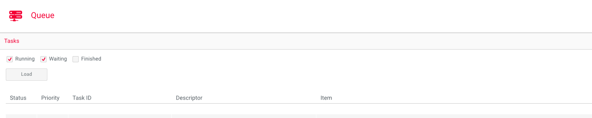

# BackOffice Intro
The CHILI BackOffice is effectively just a file explorer for a given CHILI environment and a GUI for various REST calls. You can access a given environment's BackOffice with the following URL:
```
https://{environment}.chili-publish.online/{environment}/interface.aspx
```

Upon logging in, you'll be greeted with the following screen:

Looking at the top toolbar, from left to right, we can see the following:
- The current environment
- The "Resources" tab
- The "Settings" tab
- The "System" tab

The current environment is pretty self-explanatory, so we'll skip straight to the other tabs.

## Resources
  
From the Resources tab, you can access any "resource" that lives in your environment's BackOffice. This is the file explorer portion of the BackOffice.

## Settings
  
The Settings tab is where you can view, edit, and create various settings presets related to both document processing and user permissions. There's a lot here, but for the purposes of this training we'll focus in on the "Users" and "User Groups" sections for now. 

  
From the Users page, you can view, edit, create, or delete users for an environment. Of note here is the "Environment Administrator" checkbox when viewing user details. When this is enabled, that user is set as an admin, which means that they have permissions to do just about anything. It should go without saying, but you should not enable this for the majority of your users. An important thing to keep track of here is that CHILI users typically never correspond to your end users; these are usually either environment administrators, who are actively working in the BackOffice, CHILI end users, who also work directly in the BackOffice but with some specified restrictions, or API users, which are used to generate API keys with the specified permissions for use with your own integration.
If the Environment Administrator setting is unchecked, you'll see a "Priveleges" section where you can assign different "groups" to that user. These groups can be configured here:  
  
From this page, you can configure different User Groups to have different sets of permissions. This is where you would configure permissions for your CHILI users. As a general rule, you should always try to give the least amount of permissions possible while still maintaining the functionality you need.

## System
  
The System tab is where you interface with anything specific to the running of the environment. For the purposes of this training, the only section we'll look at here is the "Queue" page.  
  
The Queue page is where you can see the status of any tasks that the environment is currently processing or has processed. Tasks will be discussed in more detail in the next section, but for now know that this is where you can find a quick list of all the tasks currently tracked by the environment.