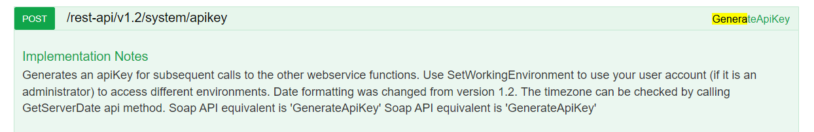

# Working With The HTTP API

## Chapter Setup
This chapter is pretty easy. We will first be working with swagger and then we move to writing some JavaScript.

There is only two setup steps:
- Create a `chiliBackOfficeInterface.js` file in your project root folder.
- Install the `cross-fetch` library. While nodejs version 18+ has a fetch library built into the system, the default timeout is quite low that some CHILI endpoints, such as generating previews, will cause a timeout. By using `cross-fetch` we make sure that the code in this project will work on all versions of nodejs above 12 and avoid awkward timeout issues.
    - You can install the library by running the following command at the root of your directory.

```
npm install cross-fetch
```

## Swagger UI
You  can find the swagger documentation on any environment URL:
```
https://{environment}.chili-publish.online/swagger/ui/index/
```

The swagger UI is broken up into sections: Resource, System, Spelling, and Settings. These unfortunately do not relate to the sections similar named in the BackOffice application.


However, as a developer, you will most likely only care about Resource and System.

The swagger documentation documents all endpoints used by Publisher and the BackOffice, meaning that very few of the endpoints on the swagger page are of any interest to you as a developer.

Each endpoint has a HTTP request method (verb), endpoint path, and a related method name.


Most commonly, CHILI developers refer to these endpoints by their related method name. So for the above picture, many would call that the `GenerateAPIKey` endpoint. Historially, Publisher used the SOAP messaging protocol which defined everything in terms of methods. Later, these SOAP methods were converted into HTTP endpoints.

You can use swagger to test out endpoints, but you will need to provide an API key for mosted endpoints to function properly. There are a few exceptions, such as GenerateAPIKey.

To get an API key, you generate on using GenerateAPIKey in the swagger UI. However, another option is to snag the API key if you are already logged into a BackOffice session.

As mentioned in the BackOffice Intro[Needs Link], the BackOffice uses the same API calls as found in the swagger UI. So each call in the BackOffice has an API key attached to the header of the request.


You can grab this API key and paste it into the input at the vert top of the swagger UI page. Then press `Explore`.


Once `Explore` is pushed, all requests made in the swagger UI will have this API key attached to request.

Let's not steal an API key from the BackOffice but instead generate our own...

# Creating API Functions
We took a look at Swagger, but eventually you are going to want to build out your own API library that will allow you to interface with the Publisher environment.

We are going to create a few functions to get the hang of how to use the API, and then we will be asking you to create your own functions.

In the git chapter folder, `02_HTTP_API_And_Swagger` you can find a completed `chiliBackOfficeInterface.js` with comments that explain each an every step.

The functions we will build together are:
- Generate API key to use in other API calls - `generateAPIKey`
- Getting the resource tree level to see documents in a folder
- Updating document variables
- Creating PDF output using id and then using XML
- Getting the finished task of a PDF output
- Generating a preview of a document

The functions you will be building on your own are:
- Verifying an API key is still valid
...


## Building a Generate API Key Function
⚠️ All repsonses are XML, there is no JSON response  
To build a function to generate an API key, we need to look up the function details in swagger.




For example, the URL has the query parameter `environmentOrURL`


If you make this API call without this parameter you will get back a 404 status code, that is because in this case the `environmentOrURL` parameter is required. Typically the swagger documentation will mark optional parameters when they are optional.
![Need Picture showing option vs not optional parameter]

You cannot assume that every failed call will be reflected in its status code, however. Different failure states will result in different status codes, and sometimes failures will not be reflected in the status code at all, but rather in the response XML. For example, using `GenerateAPIKey` alone, we can see a number of different kinds of failed calls:

    - Giving incorrect credentials results in a 201 success code, but with an error in the response body
    - If the given environment doesn't exist, you will still get a 201 success code with an error in the response body
    - If the request body isn't formatted correctly, you will get a 400 response code
These are just the different kinds of failures you can see on a relatively simple endpoint like `GenerateAPIKey`, so be sure to keep an eye on both the response code and the response body itself anytime you make use of the CHILI API library.


## Building ResourceGetTreeLevel Function
Once we have an API key, we can start to fully explore the rest of the API library. One of the more commonly used endpoints by developers is `ResourceGetTreeLevel`. Put simply, this endpoint returns a list of the resources present starting at the specified parent folder in an environment's BackOffice. When looking at this call in Swagger, you can immediately see some minor differences; this call has both a required parameter in `resourceName` as well as a number of optional parameters, and this endpoint does not have a request body. Another thing to spot is that this endpoint's actual URL changes based on one of the parameters (`resourceName` in this case).  


A major difference that isn't immediately visible, however, is that this endpoint, and most every other endpoint, reequires an API key in its request headers. Swagger does this automatically for all requests when you input an API key in the input field at the top of the page. You can confirm this for yourself by looking at the `Curl` after making a request via Swagger.  


When building these function calls in actual development, however, you need to include the API key in your request headers yourself. Included in this training section is a .js file that has some examples of various API calls built using `fetch` where you can see some examples of what the request headers should include.
## DocumentCreatePDF
Another very common endpoint is `DocumentCreatePDF`. This endpoint creates a `task` (more on that in a minute) to generate a PDF from a given document ID. On its face, it looks pretty similar to the other two endpoints we've covered so far, and as far as just calling it goes it does largely work the same.  
The major differentiator for this endpoint becomes apparent when you see the response.  


This endpoint, as well as a few others, doesn't directly generate a PDF, but rather creates a `task` to generate a PDF. While it may seem pedantic, this is actually a very important distinction. A `task` is what CHILI uses to handle longer jobs, such as generating the various output options for documents. The `task` is ultimately what holds the desired response for endpoints like `DocumentCreatePDF`, once it is finished. One thing to note is that this means that for endpoints that only generate `tasks`, like `DocumentCreatePDF`, it is incredibly difficult to receive an error response, so you should keep this in mind while developing.

Why use `tasks` at all? Imagine a scenario where you have an incredibly large, complex document that you want to output to a PDF. The total time for the generation could take upwards of 15-20 seconds in this case. If we didn't have `tasks`, then that means that you would have to wait that full time before getting any response back from the `DocumentCreatePDF` endpoint, which wouldn't be a pleasant development experience. Instead, using `tasks`, you can get a response immediately from the endpoint that just gives the details of the created `task` that you can then track using...


## TaskGetStatus
`TaskGetStatus` is an endpoint that takes a `task` ID and returns the associated `task` XML. The response XML has a number of attributes that gives details about the `task`, but these are the most relevant ones to look at:  
```
REMOVE THIS IN FINAL 
double check these attribute names and what the values can be ('True' v 'true')
Throw in at least an image of a task XML
```
- `id` - The identifier for the task in question
- `Finished` - Can be 'true' or 'false', indicates whether the task is still running or not
- `Succeeded` - Can be 'true' or 'false', indicates whether the task finished successfully or failed
- `result` - Will contain a URL and relative URL to download the output


The typical workflow when dealing with `tasks` is to regularly ping the `TaskGetStatus` endpoint with your `task` ID until you see that it finished, at which point you would either extract the result URL or handle any errors that appeared.

There are some pitfalls to watch out with `tasks`. For one, it is possible that you will see a `task` with `succeeded` == `true`, but with an empty `result`. Another thing is that there are some inconsistencies with formatting within the endpoint; you might see `true` written as `True` (with a capital T) for some attributes, which is something to keep in mind when parsing the response XML.